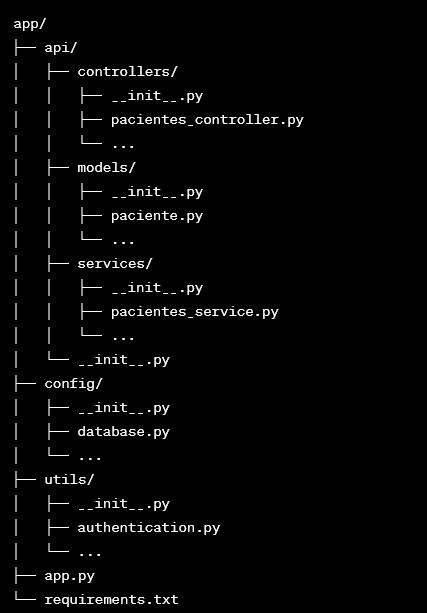

Este API-REST está diseñada para la gestión de servicios veterinarios, este deberá contener la siguiente estructura:

app/
├── api/
│   ├── controllers/
│   │   ├── __init__.py
│   │   ├── pacientes_controller.py
│   │   └── ...
│   ├── models/
│   │   ├── __init__.py
│   │   ├── paciente.py
│   │   └── ...
│   ├── services/
│   │   ├── __init__.py
│   │   ├── pacientes_service.py
│   │   └── ...
│   └── __init__.py
├── config/
│   ├── __init__.py
│   ├── database.py
│   └── ...
├── utils/
│   ├── __init__.py
│   ├── authentication.py
│   └── ...
├── app.py
└── requirements.txt

Ahora, explicaré brevemente la función de cada directorio y archivo:

    app/: Directorio principal de la aplicación.
        api/: Contiene la lógica específica de la API.
            controllers/: Define los controladores Flask que manejan las rutas y las solicitudes HTTP.
            models/: Contiene las clases que representan los modelos de datos de tu aplicación (por ejemplo, la clase Paciente).
            services/: Implementa la lógica de negocio y la interacción con la base de datos.
        config/: Almacena archivos de configuración para tu aplicación, como la configuración de la base de datos.
        utils/: Contiene utilidades y funciones auxiliares para tu aplicación.
        app.py: Archivo principal que inicializa la aplicación Flask y configura las rutas.
        requirements.txt: Lista las dependencias de Python necesarias para tu aplicación.

Con esta estructura, puedes organizar tu código de manera modular y mantener una separación clara de responsabilidades. Por ejemplo, en los controladores Flask dentro de api/controllers, definirías las rutas y las acciones asociadas a cada ruta. Luego, en los servicios dentro de api/services, implementarías la lógica de negocio y la interacción con la base de datos utilizando los modelos definidos en api/models.

En cuanto a la seguridad, puedes implementar medidas como la autenticación de clientes y la protección de rutas sensibles. En el directorio utils, puedes crear un archivo authentication.py donde implementes la lógica de autenticación, por ejemplo, utilizando tokens JWT (JSON Web Tokens). Además, puedes aplicar validaciones y autorizaciones en tus controladores para garantizar que solo los clientes autorizados puedan acceder a ciertas funciones o datos.